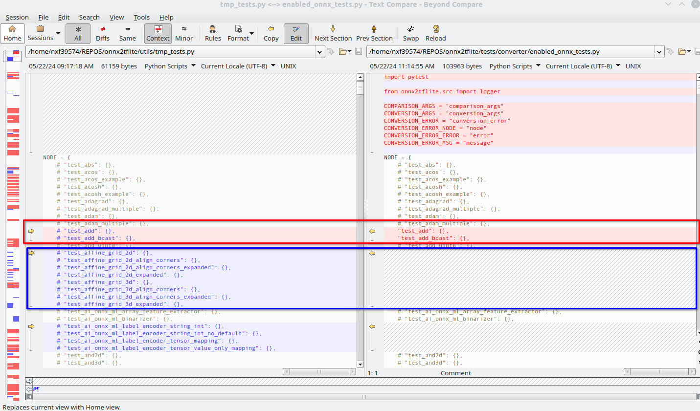

# Upgrade onnx2tflite for new ONNX and TFLite version

As part of the maintenance activities the converter must keep aligned with ONNX and TensorFlow Lite evolution.
Therefore, both the ONNX and TensorFlow Lite version has to be regularly updated to follow the community releases
and the converter to get updated with new features introduced by the ONNX or TensorFlow Lite.
Typically, such an upgrade happens quarterly, and is aligned with frameworks release as part of eIQ Core.

This guide describes the steps and consideration when upgrading the converter for new community version.
The onnx2tflite project uses following 3rd party components, which has to be aligned with the community development:

- [ONNX](https://github.com/onnx/onnx|ONNX)
- [ONNX Runtime](https://github.com/microsoft/onnxruntime)
- [TensorFlow Lite](https://github.com/tensorflow/tensorflow)

## Upgrade the ONNX

The ONNX standard is used as baseline for OpSet support for the converter. The project uses following features of the
ONNX:

- ONNX OpSet and version
- ONNX file schema
- ONNX test suite for reference implementation

The ONNX version is determined by the version the ONNX Runtime it is compatible with. This can be found in the
ONNX Runtime, either in the Release Notes, or in the onnx submodule in `cmake/external/onnx`, e.g.:

```bash
cd onnxruntime
git fetch --all
git checkout v1.17.0 # Update accordingly
git submodule update --recursive
cd cmake/external/onnx
git log
``` 

Except of only upgrading the ONNX version the changes has to be identified,and optionally the onnx2tflite updated
accordingly.

### Identify changes in the ONNX

To indentify changes in the ONNX use the git diff tool and compare the corresponding release tags. The TortoiseGit
provides a handy GUI interface for such a comparison. Following changes are important to identify and document
for the review.

1. Summarize ONNX OpSet changes - both changes in existing operators and new operators in the OpSet.
   Review the diff for the `docs/Operators-ml.md` and `docs/Operators.md` files. Create a brief summary of the changes
   to for review and discussion by the development team. You can use such a template, be brief in the field of changes.
   It is supposed to be a summary to highlight potential breaking change or opportunities. Propose action items for
   operators already supported by the converter.

   | Domain        | Operator        | Supported | Version  | Changes                                | Action Items                  |
   |---------------|-----------------|-----------|----------|----------------------------------------|-------------------------------|
   |               | ConstantOfShape | Yes       | 9 -> 20  | New datatypes                          | None: Not supported by TFLite |
   |               | ReduceMax       | No        | 18 -> 20 | Clarification behaviour for empty sets |                               | 
   | com.microsoft | MoE             | No        | new      | Mixture of experts                     |                               |

2. Summarize changes in ONNX OpSet shape inference
   functions - [ONNX shape inference](https://github.com/onnx/onnx/tree/main/onnx/shape_inference) is internally used by
   ONNX Runtime. Shape inference functions for specific operators are defined in operator definition
   schemas ([example for TopK op](https://github.com/onnx/onnx/blob/v1.16.1/onnx/defs/math/defs.cc#L1492)). Tracking
   changes in definition files is challenging because it includes all the changes done in operator
   specifications.

   They can be found in [operator definitions](https://github.com/onnx/onnx/tree/main/onnx/defs). Definitions are
   available in subdirectories of `onnx/defs/`.

3. Add the new operators into the `ONNX to TFLite Operator Map.xlsx` on the project document repository (Sharepoint)

### Update the ONNX version in onnx2tflite

1. Update the subproject in `thirdparty/onnx`.
2. Update the Readme.md `onnx-badge` item
3. Update the [requirements.txt](../requirements.txt) and [pyproject.toml](../eiq/converter/onnx2tflite/pyproject.toml)
4. Update the `MAXIMUM_VERIFIED_OPSET` in `convert.py`.

### Update the list of test

With the new ONNX version, new test cases can be added for the reference implementation. It is useful to keep the
`enabled_onnx_tests.py` up to date to leverage these new test cases. The update is partially automized.

1. Run the `utils/update_onnx_test_list.py`. The tool generates a file tmp_tests.py in the current working directory:
    ```
    $ python utils/update_onnx_test_list.py
    ```
   NOTE: The format of `tmp_tests.py` is same as for `enabled_onnx_tests.py`, the tests are listed in corresponding
   dictionaries, and commented out by default.
2. Use a diff tool, for instance _BeyondCompare_ to add the new test cases. The new tests are simply identified as
   missing pieces in the `enabled_onnx_test.py` (blue). Do not change existing items (red): 
3. Enable the new test for existing operators and run the unit tests. Review the results and either:
    - Fix the problems,
    - file corresponding GitHub/Jira tickets, if the fix requires significant effort or investigation,
    - comment out the test if it is irrelevant.

## Upgrade the ONNX Runtime

ONNX Runtime is used in this project as:

- extension to standard ONNX operators, provided by ONNX Runtime Contrib Operators
- reference runtime for the ONNX models
- base for the eIQ QDQ Quantizer tool.
- base for the Model Shape Inference

### Identify changes in operator set

Changes in non standardized ONNX operators provided by the ONNX Runtime (contrib ops) shall be identified also,
as the converter supports them.
For this same guide applies as for the [ONNX operators](#Identify-changes-in-the-ONNX).
The source diff shall be analyzed for the docs/ContribOperators from the ONNX Runtime repository.

### Changes in CPU backend implementation (_Optional_)

Not all the flavors of the ONNX operators are implemented in the ONNX Runtime, list the tags `ONNXRT`.  
Such cases are identified and documented in the code as the operator conversion is implemented, or in the
[enabled_onnx_tests.py](../tests/converter/enabled_onnx_tests.py). Going through the
ONNX Runtime implementation changes is not effective. More effective is to find the limitation documented in the
onnx2tflite and check specifically if the limitations are already resolved in the ONNX Runtime implementation.
The relevant ONNX Runtime folder is `onnxruntime/core/providers/cpu/*`.

### Changes in the ONNX Runtime Quantizer

Internal quantizer [`onnx2quant`](../onnx2quant/qdq_quantization.py) relies on default
[QDQ quantizer](https://github.com/microsoft/onnxruntime/blob/main/onnxruntime/python/tools/quantization/qdq_quantizer.py)
provided by ONNX Runtime. Quantization process lies in node-by-node processing and marking of I/O tensors for
quantization. Marking is done inside node
specific [registries](https://github.com/microsoft/onnxruntime/blob/main/onnxruntime/python/tools/quantization/registry.py#L66).
We are interested in `QDQRegistry` and also `QLinearOpsRegistry`, because they are both used during QDQ quantization.
Operators defined in `QDQRegistry` are quantized based on assigned class. Those in `QLinearOpsRegistry`
are quantized as `QDQBaseOperator` (inputs and outputs are quantized without any additional logic).

TFLite quantization is stricter about quantization parameters than
ONNX ([TFLite quantization specification](https://www.tensorflow.org/lite/performance/quantization_spec#int8_quantized_operator_specifications)).
For example, ONNX `Slice` doesn't require all IO tensors' q-params (scale & zero point) to be the same. That's not the
case for TFLite `Slice`. TFLite also sometimes simply ignores this problem introducing error to the computation.
Because of that, it is sometimes necessary [override or add](../onnx2quant/qdq_quantization.py) implementation of
quantization marking for some operator in registry.

Due to reasons mentioned above, we have to keep eye on:

1. New entries
   in [QDQ and QLinearOps registries](https://github.com/microsoft/onnxruntime/blob/main/onnxruntime/python/tools/quantization/registry.py).
2. Changes in current implementations
   of [operator quantizers](https://github.com/microsoft/onnxruntime/tree/main/onnxruntime/python/tools/quantization/operators).
3. Changes
   in [QDQQuantizer](https://github.com/microsoft/onnxruntime/blob/main/onnxruntime/python/tools/quantization/qdq_quantizer.py).

### Changes in the ONNX Runtime Symbolic shape inference

Converter and also quantizer use extended version
of [symbolic shape inference](https://github.com/microsoft/onnxruntime/blob/v1.17.0/onnxruntime/python/tools/symbolic_shape_infer.py)
algorithm provided by ONNX Runtime. Extended variant is available
in [model_shape_inference.py](../onnx2tflite/src/model_shape_inference.py). Extension is done via adding/overriding
node-specific `dispatchers`, that are responsible for inference of output tensors' shapes.

Due to reasons mentioned above, we have to keep eye on:

1. Modified and added dispatchers
   in [ORT Symbolic shape inference](https://github.com/microsoft/onnxruntime/blob/v1.17.0/onnxruntime/python/tools/symbolic_shape_infer.py).
2. Changes in ONNX [operator definitions](https://github.com/onnx/onnx/tree/main/onnx/defs). This should be covered when
   updating ONNX, but there could be some incompatibilities between different version ONNX and ORT. Definitions are
   available in subdirectories of `onnx/defs/`.

### Update the ONNX Runtime version

1. Update the ONNX Runtime version in [requirements.txt](../requirements.txt) and
   [pyproject.toml](../eiq/converter/onnx2tflite/pyproject.toml)

#### Note for versioning in requirements.txt

ONNX and ONNX Runtime in `requirements.txt` are set up to pull the latest patch versions:

```requirements
onnx~=1.15.0
onnxruntime~=1.17.0
```

It is not expected significant changes to happen in the patch version, primarily fixes only.
The [onnx submodule](../thirdparty/onnx) needs manual update. This is safe to update without any investigation.

## Upgrade the TensorFlow Lite

### Identify changes in the TFLite OpSet

Similarly, as for ONNX OpSet the changes in the TensorFlow Lite's operator set must be identified. Following template
can be used:

| Operator             | Used | Version | Changes                 | Action items          | 
|----------------------|------|---------|-------------------------|-----------------------|
| BuiltinOperator_LESS | Yes  | 2 -> 3  | input type can be int16 | Add support for int16 |

Typically, the changes in the Tensorflow Lite are extensive, so following approach is proposed:

1. Update the new operator in the spreadsheet based on changes in `tensorflow/lite/core/kernels/register.cc`
2. Get the high level changes from the `tensorflow/lite/tool/versioning/op_version.cc`. The file describes the
   conditions
   how the MLIR decides about the TensorFlow Lite operator version.
3. Mark which TFLite operators are currently used in the converter, see
   [builtin_options](../onnx2tflite/src/tflite_generator/builtin_options).
4. Review the changes for used operators and compare them with the use in the converter. Effective was found the
   combination of `git diff` and `git blame` on corresponding file in `tensorflow/lite/kernels/`
5. Summarize the action items for the TFLite operators which are used by the converter.

### Update the TensorFlow Lite version

1. Increase version of TensorFlow in **requirements-dev.txt**, **Makefile** (target `get-tflite-schema`) and
   **README.md** (`tensorflow-badge`).

2. Update the version of the flatbuffers library in [Makefile](../Makefile) to version used by the
   corresponding version of the TensorFlow. You can find it in the
   [tensorflow/third_party/flatbuffers/workspace.bzl](https://github.com/tensorflow/tensorflow/blob/master/third_party/flatbuffers/workspace.bzl)

3. Download the corresponding `flatc` compiler from https://github.com/google/flatbuffers/releases, unpack it and update
   the PATH variable. Example:

   ```bash 
   $ wget https://github.com/google/flatbuffers/releases/download/v23.5.26/Linux.flatc.binary.g++-10.zip
   $ unzip Linux.flatc.binary.g++-10.zip
   $ export PATH=$PATH:`pwd`
   ```

   Sometimes the `flatbuffers/workspace.bzl` contains a specific commit instead of a release version. In these cases,
   the `flatbuffers` can be installed the following way (just replace the _<commit_id>_):

   ```bash
   $ wget https://github.com/google/flatbuffers/archive/<commit_id>.tar.gz
   $ tar -xvzf <commit_id>.tar.gz
   $ cd flatbuffers-<commit_id>
   $ cmake -G "Unix Makefiles"
   $ make
   $ export PATH=$PATH:`pwd`
   ```

4. Download new TFLite schema and regenerate flatbuffer interface with:

   ```commandline
   make regenerate-tflite-lib
   ```

> ``📝`` Make sure your `flatc` version corresponds to flatbuffer version in __requirements*.txt__ files.

## Update the docker image (_Optional_)

After changes in the requirements*.txt files, create and deploy new version of `onnx2tflite_builder` Docker image
by following the instructions in **ops/README.md**.
